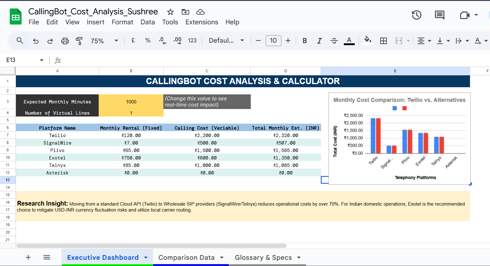
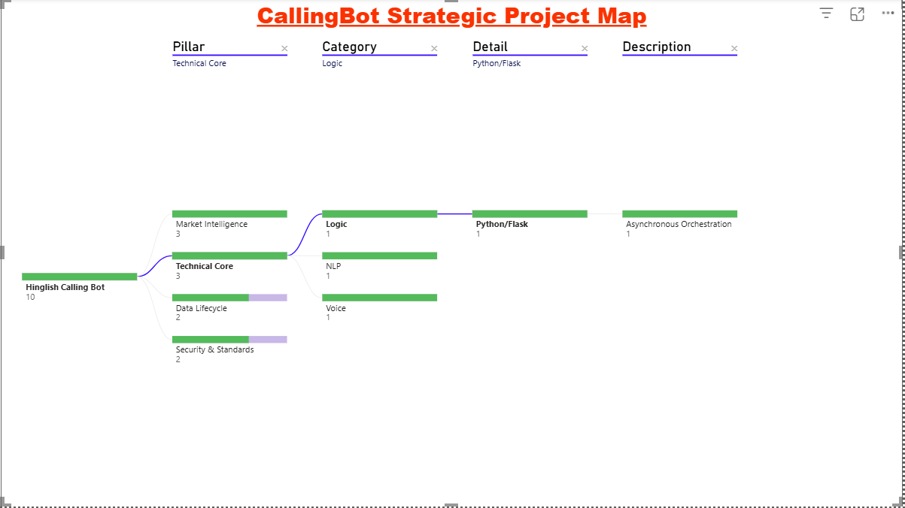

# 📊 Telephony Cost Analysis & Market Research

_A technical and financial research project to identify least-cost, high-efficiency alternatives to Twilio for AI Calling Bots._

---

## 📌 Project Overview
This research was conducted for the **CallingBot Project** to address the high operational costs associated with standard Cloud APIs like Twilio. The goal was to build a dataset comparing global wholesale providers and Indian domestic carriers to achieve a **70-80% reduction in per-minute costs.**

## 🚀 Interactive Dashboard
I have built a dynamic cost calculator in Google Sheets. You can input call volumes to see the real-time financial impact.

🔗 **[View Interactive Google Sheet](https://docs.google.com/spreadsheets/d/1jOtlzgpqzQ-TX8pHrBq6kIIz4ChbIPjmrA19sdlKV6M/edit?usp=sharing)**

---

## 📊 Key Comparison Dataset

| Platform | Type | Outbound (INR/Min) | Monthly Rental (INR) | Best Use Case |
| :--- | :--- | :--- | :--- | :--- |
| **Twilio** | Cloud API | ₹2.20 | ₹120 | Global/Standard |
| **SignalWire** | Wholesale | **₹0.50** | **₹7** | **Maximum Savings** |
| **Exotel** | Indian API | ₹0.60 | ₹750 | **Indian Domestic** |
| **Plivo** | Cloud API | ₹1.50 | ₹65 | Twilio Alternative |

---

## 💡 Top Research Insights

1. **The "Wholesale" Advantage:** By moving from a Retail API (Twilio) to a Wholesale SIP provider (SignalWire), we reduce the cost-per-minute by **~77%**.
2. **Currency Mitigation:** Using Indian providers like **Exotel** eliminates the risk of USD-INR exchange rate volatility, providing stable monthly billing for domestic operations.
3. **Open-Source Orchestration:** By using open-source software like **Asterisk** or **FreeSWITCH**, we can bypass platform fees entirely and pay only the raw carrier rates.

## 📂 Repository Structure
- `CallingBot_Cost_Analysis_Sushree.xlsx`: Full interactive dataset and cost calculator.
- `README.md`: Executive summary and market findings.
- `cost_analysis.png`: Dashboard screenshot for quick reference.

---

<h2>👤 Author & Contact</h2>

**Sushree Bandita Das**  
 
 📧 Email: sushreebanditadas01@gmail.com  
 

  
  
  
  

